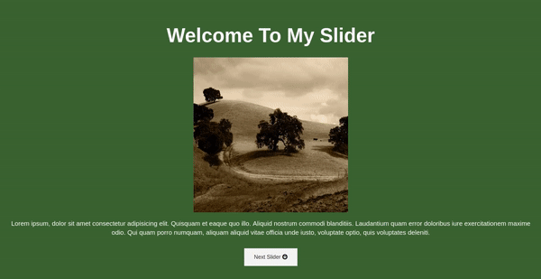

# Website Slider

  

## Installation

  

Run `npm install`

  

## Usage

  

In the terminal, running the following command

  

`npm run start`

  

It will:

  

1) Run the SASS file watcher

2) Run the npm live-server

  

## Advanced Usage

  

- To run the live server, run `npm run serve`

- To run the SASS file watcher run `npm run scss-watch`

- For a one-time SASS/SCSS build, run `npm run scss-compile`

- For a one-time SASS linter check, run `npm run sass-lint`

  

## Preparing for your assignments

  

**Important!** Before working on these assignments, please make sure to create

a new branch with the name "solution" in the terminal;

  

`git checkout -b solution`

  

When you have finished making your changes, use the following command to mark all changed files

to be added to the next commit;

  

`git add .`

  

And then commit as follows;

  

`git commit -m "Your message"`

  

Replace the text _Your message_ with something a short summary of the changes you've made

  

It's good practise to separate your code changes into multiple commits,

for example - if you're building a website, you might want to have 1 commit for your header code,

one for your navigation code, etc.

  

## Submitting your assignments

  

Once you've finished your changes and you are ready to submit your work, you can push the changes

to the remote server via the following commands;

  

If you've already pushed before, you can simply use:

  

`git push`

  

If however you get an error, telling you the remote branch for "solution" does not exist, use the

following command:

  

`git push --set-upstream origin solution`

  

Once this is done, create a **Pull Request** from the `solution` branch to the `master` branch

via the GitHub interface.

  

## Assignments
**Slider Website** 
1. using the next and prev buttons show the slides from 1 to 4.
2. add the CSS to show every slide with full view port and add background-color to every slide and hide the page scroll to prevent scrolling (you should see the next after you click the button)
3. animate the intro slider (slider-1) the h1 should come from the top to the middle and the paragraph should come form the left to the middle 
4. add transition to the buttons on hover (change the colors and the background )
5. animate each slide when you click on the buttons, you can use [scroll-behavior](https://developer.mozilla.org/en-US/docs/Web/CSS/scroll-behavior)
Hint: you have to use `transform:translateX ` transform:translateY `for the animation
### Good luck!
_The whole page should look something like this_

